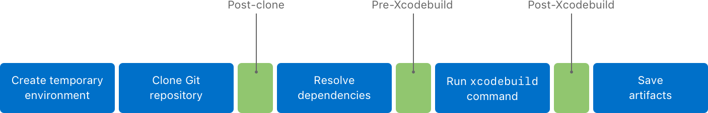
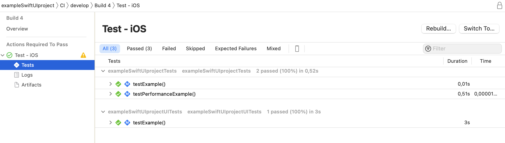
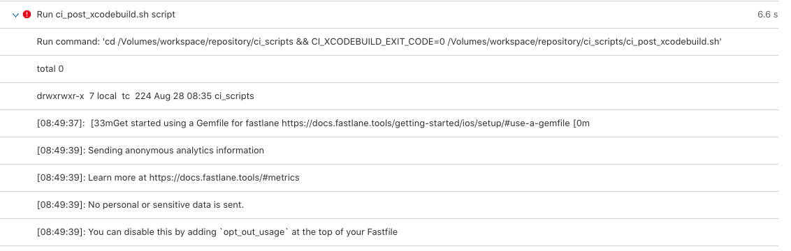

# XcodeCloud-Scripts

Este repositorio contiene scripts **vitaminados** :mechanical_arm: para Xcode Cloud para dar respuesta a esos proyectos más complejos donde herramientas como SonarQube, SwiftLint, Fastlane, etc. actúan en los procesos de CI/CD.

## Empezando

### Prerequisitos

* XcodeCloud funcionando (1 workflow para CI y 1 workflow para CD)
* Xcode 15.x

### Instala y configura

1. Clona el repositorio
2. Copia en tu proyecto (carpeta raíz) los siguientes elementos:
   - Carpeta `ci_scripts`
   - Carpeta `fastlane`
   - Fichero `sonar-project.properties`
   - Fichero `xccov-to-sonarqube-generic.sh` (Dale permisos de ejecución)
3. Configura estas opciones:


| Name | Description | File |
|---|---|---|
| `SONARQUBE_GENERAL_TOKEN_OR_APP_TOKEN` | SonarCube token para identificarse. | `ci_scripts/sonar/run_sonar_analysis.sh` |
| `SCHEME_UNIT_TESTING` | Nombre del Scheme de Unit Testing. | `ci_scripts/ci_post_xcodebuild.sh` |
| `main_folder_of_code` | Carpeta raíz del código del proyecto. | `fastlane/Fastfile` |
| `target_name` | Nombre del Target. | `fastlane/Fastfile` |
| `company_name` | Nombre de la compañía para SonarCube. | `fastlane/Fastfile` |
| `custom_message_push` | Mensaje asociado al commit de actualización del build number en el proyecto con el número que ha generado XcodeCloud. | `fastlane/Fastfile` |
| `sonar.projectKey` | Código del proyecto en SonarCube. | `sonar-project.properties` |
| `sonar.projectName` | Nombre del proyecto en SonarCube. | `sonar-project.properties` |
| `sonar.host.url` | Dirección del SonarCube. | `sonar-project.properties` |
| `sonar.projectDescription` | Descripción del proyecto en SonarCube. | `sonar-project.properties` |
| `sonar.swift.project` | Nombre del fichero .xcodeproj. | `sonar-project.properties` |
| `sonar.swift.appScheme` | Nombre del Scheme de la app. | `sonar-project.properties` |
| `sonar.swift.testScheme` | Nombre del Scheme de Unit Testing. | `sonar-project.properties` |


## Y porqué estos scripts?

A día de hoy, noviembre 2023, Apple considera que las cosas en este ámbito deben hacerse de una manera, no seré yo quien les contradiga, pero puede que no cuadre del todo con la necesidad de este tipo de proyectos complejos.



Así que os cuento algunas cosas que he vivido y he tenido que ir adaptando según se presentaban:

### Unit Testing y Coverage en Sonar

Cuando defines un worflow sencillo para la CI, donde lo que quieres es que compile y ejecute unit testing, tendrías una definición como la siguiente imagen y unos resultados de unit testing parecidos a estos.





Hasta aquí todo bien. :smiley:

La cosa se complica cuando después de estos resultados de Unit Testing quieres enviarlos a un Sonar y por tanto debes extraer la información de los test pasados, su resultado y el Coverage.

Revisando la documentación, no indica en que momento se ejecuta el paso "Test - iOS" y tampoco que exista un posterior script donde actuar sobre él. Por tanto, asumes que debes hacerlo en el Post-XcodeBuild, pero resulta que cuando lo lanzas de nuevo y observas que hace, ves que la ejecución del script en el paso de "Test -iOS", ha realizado una **especie de reset** del workspace local y los ficheros fastlane, sonar-properties que habías preparado y subido al repositorio no están disponibles.

Aquí podéis ver un simple `ls` de lo que hay en el workspace cuando llegas a este punto:



Sí, vacío. :exploding_head:

Y cómo es esto?

Pues resulta que realmente lo que veíamos en el gráfico anterior, lo ejecuta para cada paso (Archive, Build, Test, Analyze) pero dependiendo del paso el mismo realiza una u otras acciones internamente. La cuestión es que para hacer el Test usará los Artifacts que generó el Build y no necesita el código del proyecto otra vez. Por eso solo está la carpeta de scripts (estoy seguro que los copia en un temporal, borra el workspace entero y los vuelve a poner. No resetea la máquina entera, porque si haces una invocación a fastlane sin indicar uno de tus custom lanes, sí reconoce que está instalado como hiciste en el primer script de Post-clone).

Y entonces como puedes desbloquear este punto?

Pues la solución es cambiar el workflow para que haga Build e intervengas en el Post-Xcodebuild lanzando tu el Test y el resto de acciones. Esto te hace perder el report de Test en el Xcode Cloud, pero no nos engañemos, sí estás trasladando la información a un Sonar es que el report nuevo de Xcode Cloud tampoco es necesario para tu caso.

Snippet del script:

```shell
rm -rf $CI_RESULT_BUNDLE_PATH

xcodebuild \
  -project "$CI_PRIMARY_REPOSITORY_PATH/$CI_XCODE_PROJECT" \
  -scheme "$SCHEME_UNIT_TESTING" \
  -destination 'platform=iOS Simulator,name=iPhone 15' \
  -enableCodeCoverage YES \
  -resultBundlePath $CI_RESULT_BUNDLE_PATH \
  test-without-building
```

¿Qué acciones hacemos?

1. Borramos el result_bundle del build
2. Lanzamos un test sin hacer build para el device que querramos, activando el Coverage e indicando el mismo path para el result_bundle

Y así es como conseguimos invocar al resto de acciones para subir el resultado en Sonar. :white_check_mark:


## Inspiración

* [Kodeco Xcode Cloud](https://www.kodeco.com/36548823-getting-started-with-xcode-cloud)
* [Oliver Binns](https://www.oliverbinns.co.uk/posts/sonarqube-xcodecloud/)

## Recursos Oficiales

* [Xcode Cloud](https://developer.apple.com/xcode-cloud/)
* [Xcode Cloud documentation](https://developer.apple.com/documentation/xcode/xcode-cloud)
* [Github project](https://github.com/apps/xcode-cloud)

### WWDC

* [Meet Xcode Cloud](https://developer.apple.com/videos/play/wwdc2021/10267/)
* [Get the most out of Xcode Cloud](https://developer.apple.com/videos/play/wwdc2022/110374/)
* [Create practical workflows in Xcode Cloud](https://developer.apple.com/videos/play/wwdc2023/10278/)

## LICENSE

Estos trabajos están disponibles bajo la licencia MIT. Mira el fichero [LICENSE](license) para más información.

